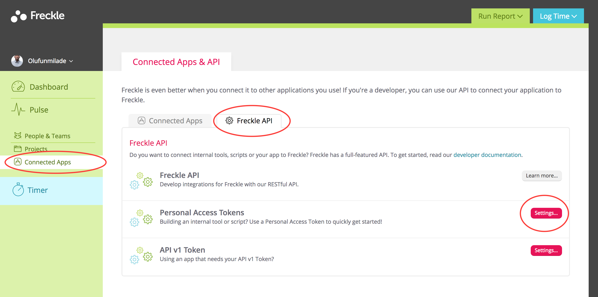
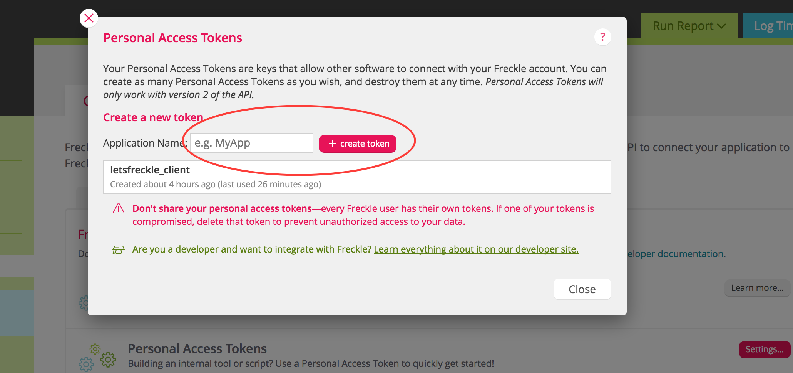

# Let's Freckle
_Freckle directly from your terminal_

_nb: the setup might be a bit long but after you're done with this, you'll be freckling away_ 🙂
## Setup 

##### On Freckle Dashboard
1. Go to your freckle [dashboard](https://andela.letsfreckle.com/time/dashboard/recent)
2. Navigate to [Freckle Api](https://andela.letsfreckle.com/time/integrations/freckle_api) under **Connected Apps**
3. Click on the settings of **Personal Access Tokens** and create a token. You could use `letsfreckle_client` for the application name.
4. **PLEASE SAVE YOUR TOKEN BEFORE CLOSING THAT PAGE**





##### Setting up the project
1. Ensure you have python install
```
brew install python
```
2. Ensure you have virtualenv installed, I prefer to use virtualenv wrapper. Read [here](http://python-guide-pt-br.readthedocs.io/en/latest/dev/virtualenvs/)
3. Clone [project](https://github.com/laddeos/letsfreckle_client)
```
git clone git@github.com:laddeos/letsfreckle_client.git
```
4. Create your virtualenv. 
_command shown assumes virtualenv wrapper_
```
mkvirtualenv letsfreckle
```
5. Navigate to project and install dependencies
```
pip install -r requirements.txt
```
6. Create a .env file in the root directory of your project
```
├── .env
├── .gitignore
├── README.md
├── freckle.py
├── log_freckle.py
├── readme_img
└── requirements.txt
```
7. Save your **Personal Freckle Token** in the .env file
```
access_token='personal_token'
```
8. Optional create an alias to easily navigate to the project folder to get you started toot sweet
```
alias letsfreckle="workon letsfreckle && cd <path_to_project>"
```
And you are all set!!!


## Let's Freckle
1. Once you are all setup, in the folder directory run
```
python log_freckle -h
```
to view what is possible
2. Log for today
```
python log_freckle.py today 480 <Project> <Description/Tag>
```
3. Log for any date as long as date is in the format yyyy-mm-dd
```
python log_freckle.py 2017-06-17 480 <Project> <Description/Tag>
```
4. If you have the alias setup, you can always easily type the alias to navigate you to the project and freckle away


That's all folks!!!!! 🐰


## Errors
If you spot an error feel free to reach out to me or drop an issue and tag me. Bye for now